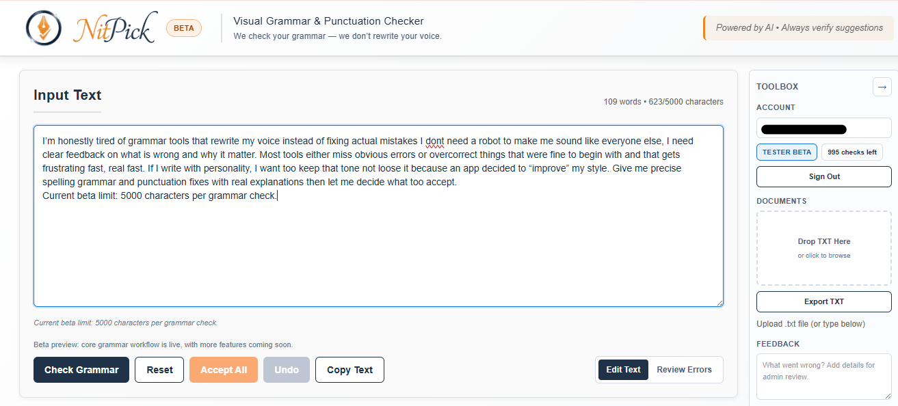
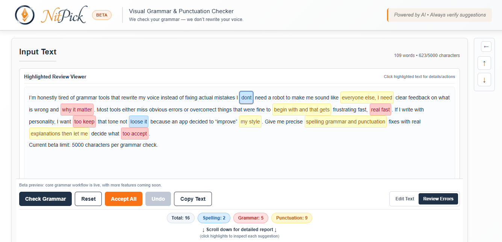
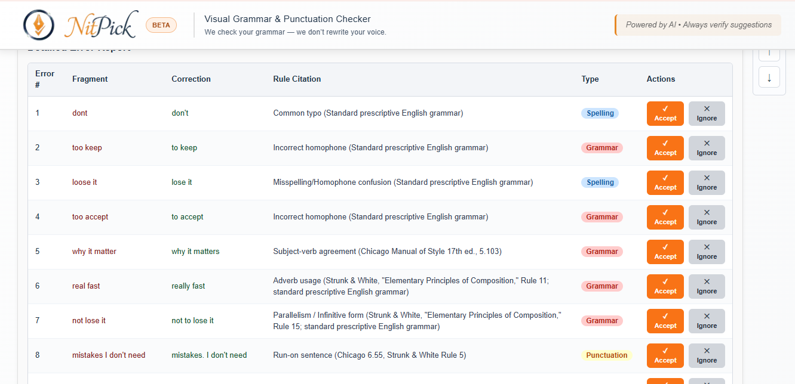
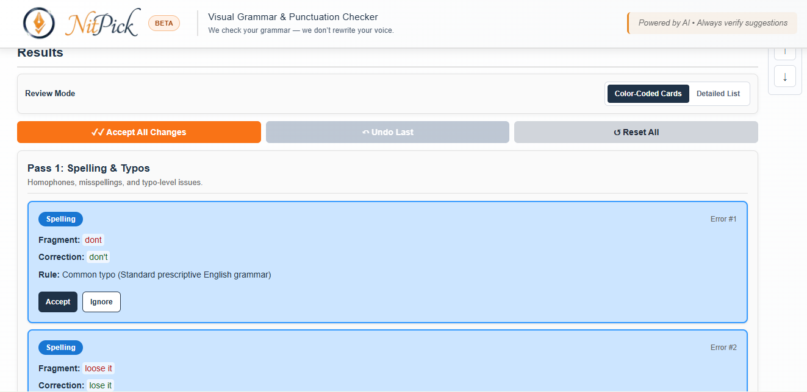
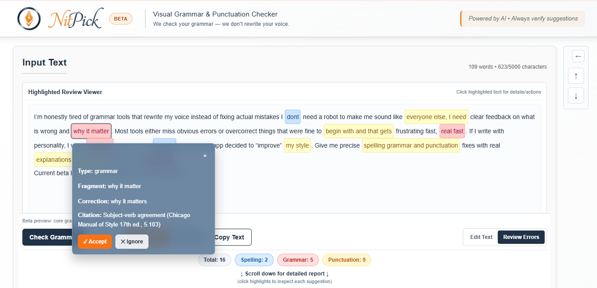
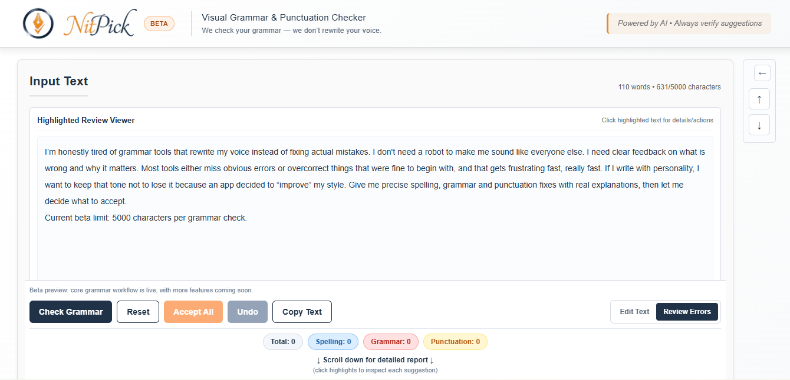

<p align="center">
  
</p>

<h1 align="center">
  <span style="color:#e68723;">Nitpick</span><span style="color:#1f3247;">AI</span>
  <sup><sub><span style="color:#a1440a;">BETA</span></sub></sup>
</h1>

<p align="center">
  AI grammar checking that flags what is wrong without rewriting your voice.
</p>

<p align="center">
  <a href="https://nitpickai.com">Live App</a> ·
  <a href="#demo">Demo</a> ·
  <a href="SCREENSHOT-CHECKLIST.md">Screenshot Checklist</a>
</p>

---

## What this is

This repository is a **public showcase** for NitpickAI.

NitpickAI is currently an **MVP/Beta** built to solve one clear problem:
most writing tools "help" by rewriting tone, intent, and style. This product does not.

It highlights grammar, spelling, and punctuation issues, explains each one clearly, and keeps the writer in control of every change.

## Why I built it

My brother is a published writer. He asked for a grammar checker that would stop wasting time and stop rewriting his voice.

That request turned into NitpickAI: practical writing feedback, visual issue detection, and user-controlled corrections.

## Demo

- Live product: https://nitpickai.com
- Loom walkthrough: *(adding this week)*

## Core beta workflow

1. Paste writing into the editor.
2. Run multi-pass analysis.
3. Review visual highlights by category.
4. Accept or ignore each suggestion.
5. Export cleaner text while preserving voice.

## Current feature scope (Beta)

- Visual issue highlights in text
- Category-based issue review
- Plain-language explanations
- Accept / ignore suggestion controls
- Batch actions for faster review
- Basic account/auth + usage gating
- Admin/testing controls for beta operations

## Beta status and limits

This is an active beta, not a finished product.

Known realities of this stage:

- UX and copy are still being refined
- Edge-case grammar logic is still being hardened
- Suggestions should always be user-reviewed before publishing
- Some workflows are intentionally optimized for testing speed over polish

## Tech snapshot

- Frontend: Next.js + TypeScript
- Backend: FastAPI (Python)
- AI orchestration: Gemini via Vertex AI
- Auth/data services: Supabase
- Hosting: Vercel + Google Cloud Run

## Architecture (high level)

```text
User Input (Web UI)
  -> Next.js frontend
  -> FastAPI analysis API
  -> Multi-pass grammar engine
  -> Structured issues + suggestions
  -> User accepts/ignores changes
  -> Final edited output
```

## Product walkthrough (screenshots)

Complete capture guidance is in [SCREENSHOT-CHECKLIST.md](SCREENSHOT-CHECKLIST.md).

### 1) Input text with real mistakes



### 2) Visual highlights after analysis



### 3) Detail panel: issue explanation



### 4) Detail cards: categorized review



### 5) Detail box: focused correction context



### 6) Final cleaned output (voice preserved)



## Client relevance (Upwork / portfolio)

This project demonstrates end-to-end execution of a production-style AI app:

- translating a real user pain point into product scope
- designing constrained AI behavior (assist, do not overtake)
- shipping full-stack architecture with deployment and auth
- iterating quickly from real feedback and edge-case failures

## Repository policy

This showcase repo is for portfolio and client evaluation.

- It does **not** include full private production source.
- Detailed implementation can be shared selectively for serious client conversations.

## Contact

If you need a focused AI workflow built for your business (not generic AI glue), reach out via Upwork.

---

### Branding notes

- Header colors intentionally match in-app brand accents (orange + blue)
- Beta tag included to set clear client expectations
- Use app logo/brand assets for visual consistency across GitHub, Upwork, and Loom
